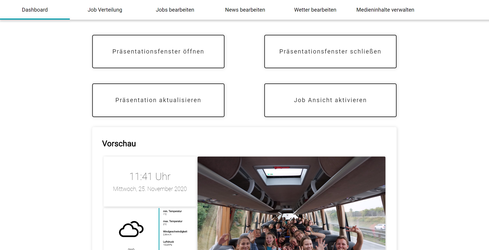
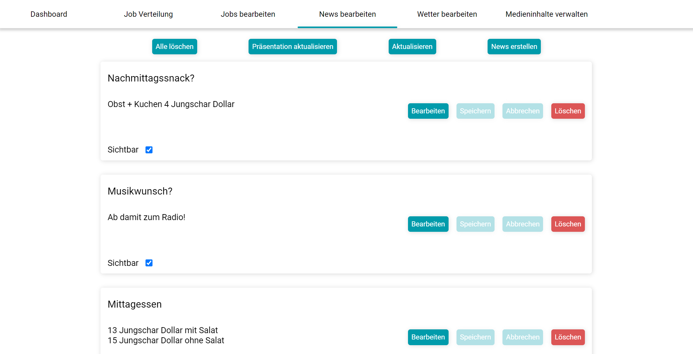
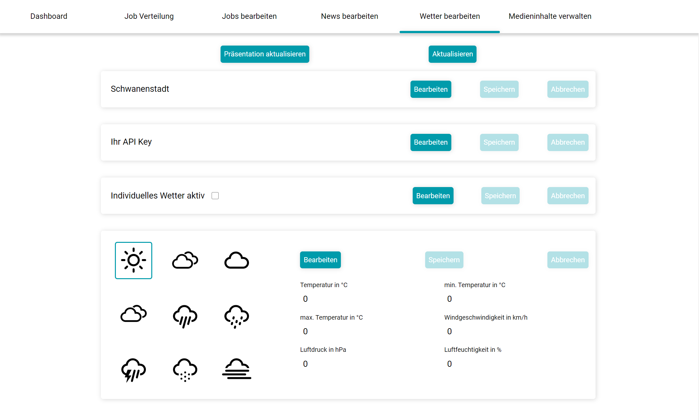

# Jungschar-Infoscreen

[TOC]

## Beschreibung

"Jungschar-Infoscreen" ist ein Software-Produkt, welches die Verwaltung und Durchführung einer Spielestadt oder ähnlichen Aktivitäten erleichtert. Es gibt eine Ansicht für Kinder, wo sie aktuelle Informationen, wie das Wetter, die aktuelle Uhrzeit oder Bilder der vergangenen Woche, ansehen können. Die Inhalte können von Kindern auch während der Aktion erstellt und bedient werden. "Jungschar-Infoscreen" richtet sich an GruppenleiterInnen und Kinder. Das Ziel ist es, bei der Organisation bzw. Durchführung unterstützt zu werden. Aufgebaut ist die ganze Anwendung in 2 Fenster, das Präsentationsfenster, in dem die Kinder den Inhalt sehen und das Verwaltungsfenster, in dem man die Inhalte verwalten und bearbeiten kann.

## Installation

Für die Erstinstallation ist Internet erforderlich. 

"Jungschar-Infoscreen" kann [hier](https://dorfingerjonas.at/jungschar-infoscreen/download) heruntergeladen werden.

Öffnen Sie den heruntergeladenen Ordner und kopieren Sie die Dateien in ein gewünschtes Verzeichnis. Öffnen Sie ``Jungschar-Infoscreeen.exe`` mit einem Doppelklick.

## Bedienung

### Allgemeine Struktur

Die Software ist auf mehrere Unterpunkte aufgeteilt:

- Dashboard
  - diverse Möglichkeiten Präsentationsfenster steuern
  - Vorschau des Präsentationsfensters
- Job Verteilung
- Jobs bearbeiten
- News bearbeiten
- Wetter bearbeiten
- Medieninhalte verwalten
- Hilfe

### Dashboard

Auf dem Dashboard sind 4 Buttons mit denen man das Präsentationsfenster steuern kann. Zuerst muss man das Fenster öffnen ("Präsentationsfenster öffnen"), das Fenster öffnet sich automatisch. Es wird empfohlen das Fenster im Vollbildmodus zu verwenden, dafür können Sie die Taste ``F11`` drücken. Um den Vollbildmodus zu verlassen, erneut ``F11`` drücken.

Mit dem Button "Präsentationsfenster schließen" können Sie das geöffnete Fenster schließen, oder Sie klicken oben rechts auf das rote ``X``.

Wenn Sie auf "Präsentation aktualisieren" drücken, wird der gesamte Inhalt aktualisiert und neu angezeigt.

Mit "Job Ansicht aktivieren" aktiviert sich die Job Ansicht im Präsentationsfenster. Mit dem selben Button kann man die Job Ansicht auch wieder deaktivieren.

Die Vorschau, wie das Präsentationsfenster ausschauen könnte, wird weiter unten angezeigt. Das Präsentationsfenster ist nicht mit der Vorschau synchronisiert.

### Job Verteilung

In der Job Verteilung können Sie die Arbeitsplätze vergeben. In diesem Fenster kann auch die Job Ansicht (de-)aktiviert werden. Sie können eine Stelle vergeben, indem Sie auf eine grüne Person klicken, das Symbol wird anschließend rot. Ein einzelner Arbeitsplatz wird mit einem klick auf eine rote Person freigegeben. Sie können mit dem "Zurücksetzen" Button alle Jobs wieder freigeben.

### Jobs bearbeiten

Hier können Sie die Währung und die Jobs ändern. Um etwas zu bearbeiten klicken Sie auf den "Bearbeiten"-Button. Um einen neuen Eintrag zu erstellen klicken Sie oben rechts auf den "Job erstellen" Button. Es öffnet sich ein Fenster, wo Sie die Informationen eintragen können.

### News bearbeiten

News werden unten im Präsentationfenster angezeigt. Sie wechseln alle 10 Sekunden und neue Meldungen können mit dem Button "News erstellen" angelegt werden.

### Wetter bearbeiten

Für die aktuellen Wetterdaten ist eine Internetverbindung erforderlich! Wenn Sie keine Internetverbindung haben oder verwenden möchten, können Sie den nächsten Punkt überspringen und lokale Wetterdaten verwenden. 

#### Wetterdaten aus dem Internet

Um die aktuellen Wetterdaten ihrer Stadt zu erhalten, geben Sie den Namen der Stadt ein, es kann auch hilfreich sein, eine größere Stadt in der Nähe auszuwählen. Im nächsten Schritt erstellen Sie sich einen Account auf https://openweathermap.org und folgen den Anweisungen auf der Website, um sich einen eigenen API-Key für die kostenlose Version zu erstellen. Wenn Sie Probleme dabei haben, können Sich mich kontaktieren. Ich kann kostenlos einen Key zur Verfügung stellen, den Sie anschließend in das Feld für den API-Key einfügen.

#### Lokale Wetterdaten

Um das lokale Wetter zu aktivieren, müssen Sie den Haken bei "Individuelles Wetter aktiv" setzen. Beachten Sie, dass Sie zuerst den Bearbeitungsmodus aktivieren. Anschließend können Sie individuelle Wetterdaten eintragen und das Icon auswählen.

### Medieninhalte verwalten

Hier können Sie die angezeigten Videos uns Bilder bearbeiten. Wenn Sie Medien hochladen, werden die Bilder automatisch in den Bilderabschnitt weiter unten verschoben und die Videos in den Videoabschnitt. Die Videos sind die am größten angezeigten Medien im Präsentationsfenster.

## FAQ

### Ist für die Anwendung eine Internet Verbindung erforderlich?

Ja und nein, grundsätzlich ist das Programm so konzeptioniert, dass es ohne einer Internetverbindung funktioniert. Eine Internetverbindung ist nur für die Installation und das Wetter notwendig. Für das Wetter gibt es allerdings die Funktion für individuales Wetter, dafür ist kein Internet erforderlich.

### Können Kosten anfallen?

Nein, "Jungschar-Infoscreen" ist zu 100% kostenfrei.

### Welchen Plattformen werden unterstützt?

"Jungschar-Infoscreen" funktioniert zurzeit nur von Windows unterstütz. An einer macOS und Linux Version wird gearbeitet.

**Bei weiteren Fragen, schreiben Sie mir bitte eine E-Mail!**

## Kontakt

Jonas Dorfinger

E-Mail: jungschar-infoscreen@dorfingerjonas.at

Telefonnummer auf Anfrage

Copyright © 2020 - 2021, [Jonas Dorfinger](https://dorfingerjonas.at/). Diese Software ist [MIT lizenziert](./LICENSE).

